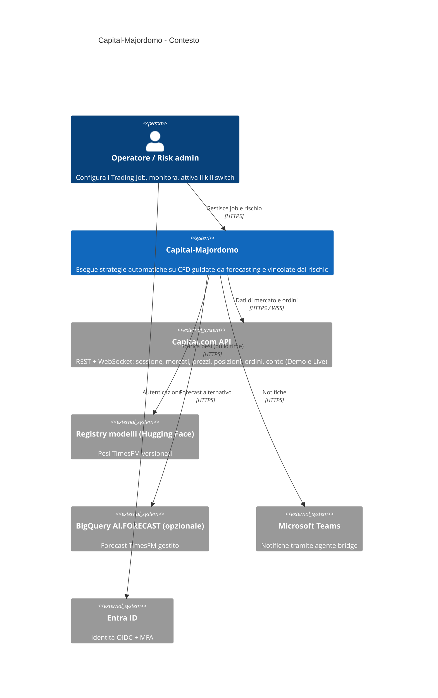
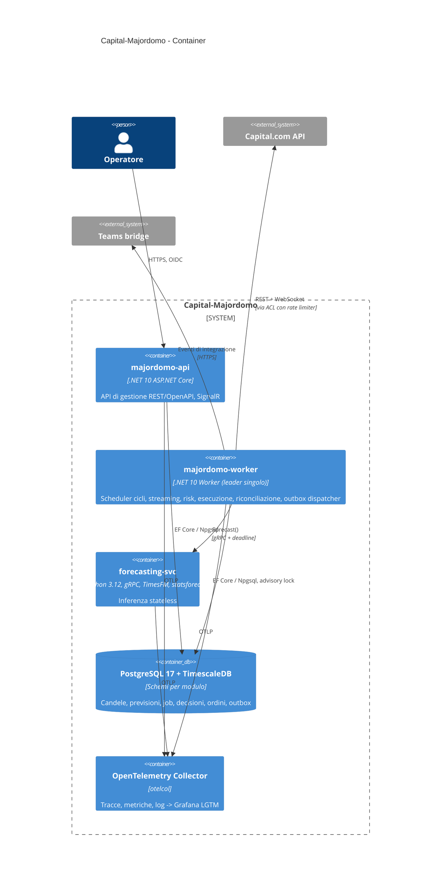
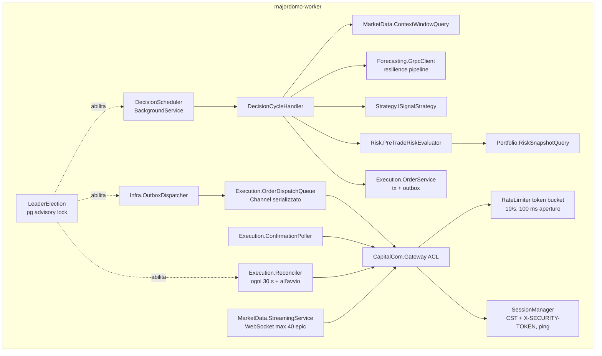
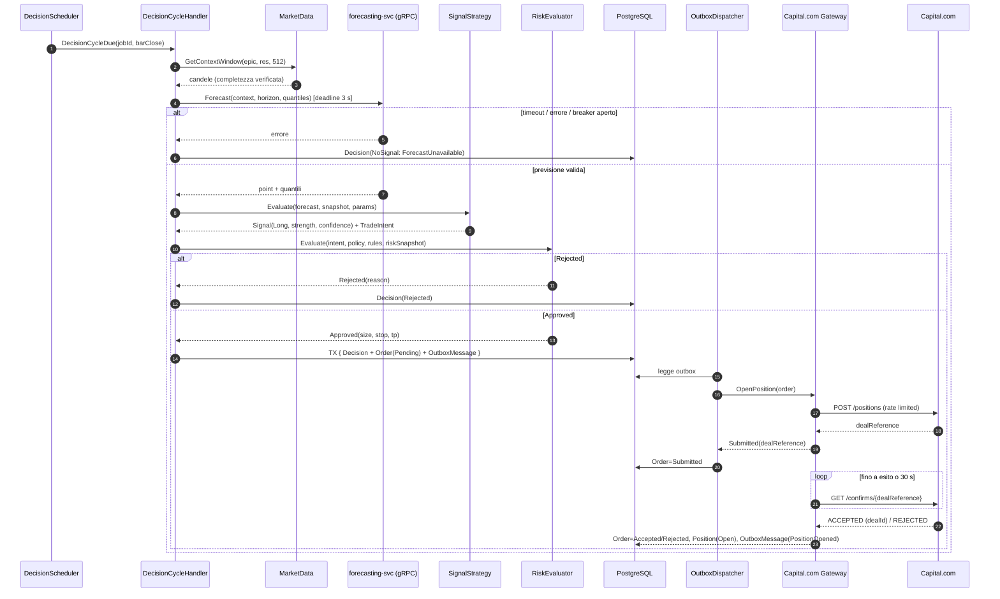
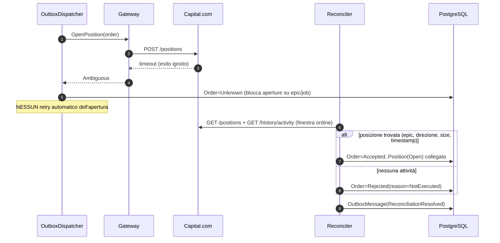
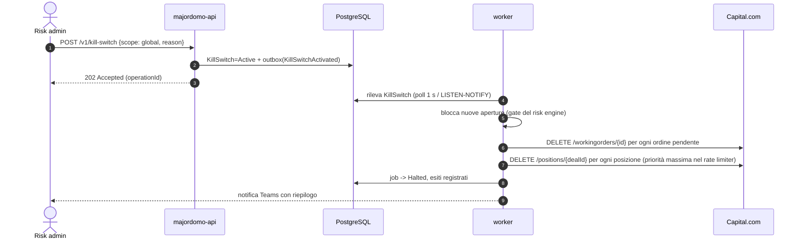

# Diagrammi C4 e di sequenza — Capital-Majordomo

Formato Mermaid (renderizzato da GitHub). Riferimento: RFC-001 §5.

## C4 — Livello 1: contesto

## C4 — Livello 2: container

## C4 — Livello 3: componenti del worker

## Sequenza — ciclo decisionale con apertura posizione

## Sequenza — errore ambiguo e riconciliazione

## Sequenza — kill switch

