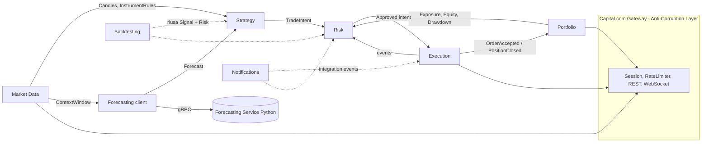
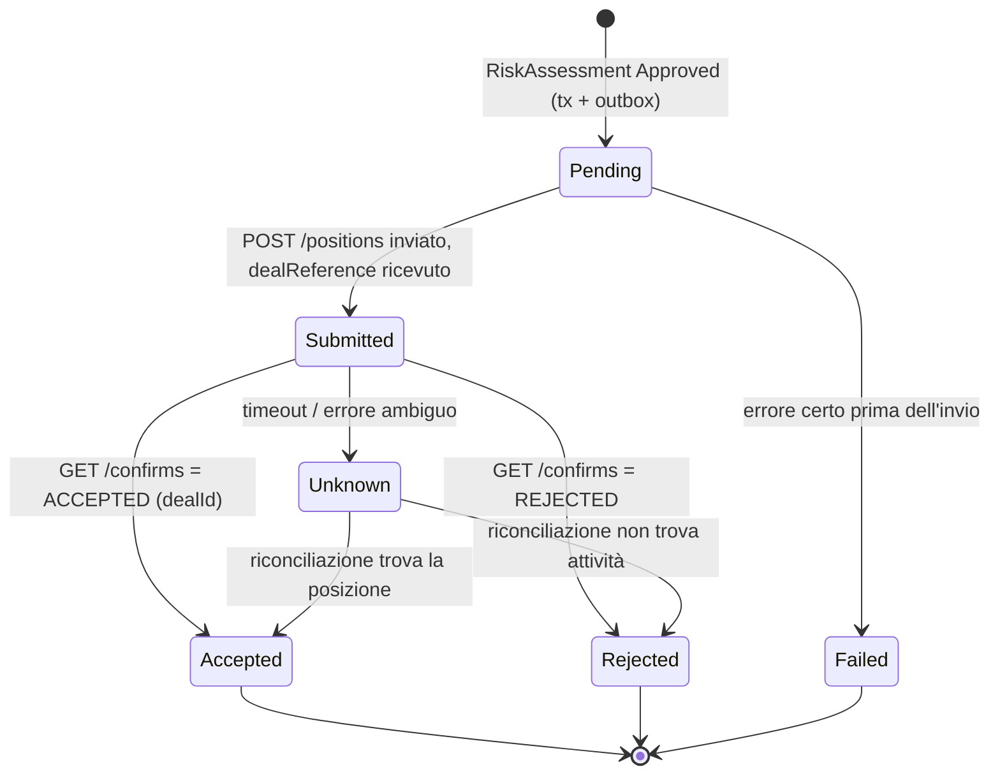

# Modello di dominio — Capital-Majordomo

Ipotesi di modello (DDD) a supporto di RFC-001. I nomi in `codice` costituiscono il linguaggio
ubiquo e vanno usati identici nel codice, nelle API e nei documenti.

## 1. Linguaggio ubiquo

| Termine | Significato |
| --- | --- |
| `Instrument` | Strumento negoziabile su Capital.com, identificato da `Epic` (es. `US500`, `EURUSD`, `GOLD`) con regole di negoziazione (size min/max/step, valore punto, orari, leva) |
| `Candle` | Barra OHLC bid/ask per `Epic` e `Resolution` (`MINUTE`, `MINUTE_5`, `MINUTE_15`, `MINUTE_30`, `HOUR`, `HOUR_4`, `DAY`, `WEEK`) |
| `ContextWindow` | Finestra di candele usata come input del modello |
| `Forecast` | Previsione puntuale + quantili per un orizzonte `H` passi, prodotta da un `ModelRef` (famiglia + versione) |
| `Signal` | Interpretazione di una `Forecast` da parte di una `SignalStrategy`: `Long`, `Short` o `Flat`, con forza e confidenza |
| `TradingJob` | Unità configurabile di "algoritmo di gestione delle transazioni": universo, modello, strategia, `RiskPolicy`, `OperationalLimits`, `Mode` |
| `ParameterSetVersion` | Versione immutabile dei parametri di un job; ogni decisione referenzia la versione usata |
| `DecisionCycle` | Esecuzione del job per una candela chiusa: dati → forecast → signal → risk → intent |
| `TradeIntent` | Proposta di apertura/chiusura generata dalla strategia, non ancora approvata |
| `RiskAssessment` | Esito del risk engine su un intent: `Approved(size, stop, takeProfit)` o `Rejected(reason)` |
| `Order` | Richiesta inviata al broker; ha `dealReference` e una macchina a stati |
| `Position` | Posizione aperta presso il broker (`dealId`), con stop e take profit |
| `Allocation` | Quota di capitale assegnata a un job; base del sizing |
| `Equity` | Saldo + P&L non realizzato del conto (fonte: broker) |
| `Drawdown` | Calo percentuale dell'equity (o dell'allocazione del job) dal massimo precedente |
| `KillSwitch` | Comando che chiude tutte le posizioni e blocca nuove aperture (globale o per job) |
| `Halt` | Stato di un job fermato automaticamente dal risk engine; richiede intervento umano per ripartire |
| `Reconciliation` | Confronto fra stato locale e broker con correzione o allarme |

## 2. Context map

Relazioni: Market Data e Portfolio sono **upstream** (open host interno); Capital.com è un
sistema esterno **conformist** schermato da un ACL; Backtesting riusa i moduli Strategy e Risk
tramite le loro interfacce pubbliche (stesso codice in simulazione e in produzione) e sostituisce
Execution con un simulatore.

## 3. Aggregati e invarianti

### 3.1 `TradingJob` (Strategy)

- Stato: `Draft | Backtesting | PaperTrading | Live | Paused | Halted | Archived`.
- Transizioni ammesse:
  - `Draft → Backtesting → PaperTrading → Live` solo in avanti e con i criteri di promozione di
    ADR-0006 (registrati come `PromotionEvidence`).
  - `PaperTrading|Live → Paused` (manuale) e `→ Halted` (risk engine/kill switch).
  - `Halted → Paused` solo con conferma manuale motivata; mai `Halted → Live` diretto.
- Invarianti:
  - Un job `Live` ha sempre una `RiskPolicy` con stop obbligatorio, perdita giornaliera massima
    e drawdown massimo valorizzati.
  - I parametri non si modificano in place: una modifica crea una nuova `ParameterSetVersion`;
    un job `Live` che riceve un aumento dei limiti di rischio torna `Paused` finché non viene
    confermato.
  - Un `Epic` può appartenere a più job, ma l'esposizione aggregata è controllata dal Risk a
    livello di portafoglio.

### 3.2 `RiskPolicy` (Risk, value object versionato) e `RiskBook` (aggregato)

- `RiskPolicy`: rischio per trade, perdita giornaliera max, drawdown max, leva max, esposizione
  max per strumento e totale, posizioni max, distanza minima dello stop, cooldown.
- `RiskBook` (uno per job + uno di portafoglio): mantiene contatori del giorno di trading
  (P&L realizzato, numero ordini, ultima perdita) e lo stato di `Halt`.
- Invarianti verificate **prima** di ogni apertura:
  1. job non `Halted`/`Paused`, kill switch non attivo, finestra operativa aperta;
  2. P&L giornaliero > −perdita giornaliera max; drawdown < drawdown max;
  3. `size` ≥ minimo dello strumento dopo l'arrotondamento (altrimenti rifiuto, non arrotondamento
     per eccesso);
  4. esposizione risultante ≤ limiti di strumento, job e portafoglio; leva effettiva ≤ leva max;
  5. stop presente e a distanza ≥ minima del broker e della policy;
  6. numero ordini del giorno < limite; cooldown rispettato.
- Le chiusure e le riduzioni di rischio non sono mai bloccate dal risk engine.

### 3.3 `Order` / `Position` (Execution)

Macchina a stati dell'`Order`:

- Invarianti: un `Order` in `Unknown` blocca nuove aperture sullo stesso `Epic` per lo stesso job
  finché non viene risolto; ogni `Order` porta `jobId`, `decisionId`, `parameterSetVersion` e un
  `clientCorrelationId` (salvato localmente; il broker non supporta chiavi di idempotenza).
- `Position`: `Open → Closing → Closed`; la chiusura può originare dal sistema o dal broker
  (stop, take profit, margin call): in quest'ultimo caso è rilevata dalla riconciliazione e
  pubblicata come `PositionClosed(source=Broker)`.

### 3.4 `Forecast` (Forecasting)

Value object immutabile: `ModelRef`, `inputFingerprint`, `horizon`, `pointForecast[]`,
`quantiles{q10,q50,q90...}[]`, `generatedAt`. Dopo l'orizzonte viene arricchito da
`ForecastEvaluation` (errore realizzato) per le metriche di accuratezza per modello/strumento.

### 3.5 `Instrument` (Market Data)

Regole di negoziazione in cache con TTL (es. 1 h) e invalidazione su errori di validazione del
broker: `minDealSize`, `maxDealSize`, `dealSizeStep`, `minStopDistance`, `marginFactor`,
`marketStatus`, orari.

## 4. Eventi di dominio (interni)

`DecisionCycleStarted`, `ForecastObtained`, `NoSignalProduced(reason)`, `TradeIntentProposed`,
`TradeIntentApproved`, `TradeIntentRejected(reason)`, `OrderSubmitted`, `OrderAccepted`,
`OrderRejected`, `OrderOutcomeUnknown`, `PositionOpened`, `PositionClosed(source)`,
`StopLevelChanged`, `DailyLossLimitReached`, `DrawdownLimitReached`, `JobHalted`,
`KillSwitchActivated`, `ReconciliationDriftDetected`.

Il sottoinsieme pubblicato all'esterno (contratto stabile) è nell'AsyncAPI
`contracts/asyncapi/integration-events.v1.yaml`.

## 5. Strategie di segnale (plug-in)

Interfaccia `ISignalStrategy.Evaluate(Forecast, MarketSnapshot, StrategyParameters) → Signal`.
Strategie iniziali:

1. **ExpectedReturnThreshold:** rendimento atteso a orizzonte H (da q50) > soglia + costi stimati
   → Long (simmetrico per Short). Stop = max(distanza minima, k × (q50 − q10)).
2. **QuantileBreakout:** apre solo se l'intero intervallo q10–q90 è sopra (o sotto) il prezzo
   corrente: alta confidenza, pochi trade.
3. **EnsembleConsensus:** richiede accordo di direzione fra almeno N modelli (es. TimesFM +
   ETS) — riduce il rischio di modello.

Le strategie sono funzioni pure (deterministiche dato l'input): ciò rende identici backtest e
produzione e consente di riprodurre ogni decisione dal decision log.
